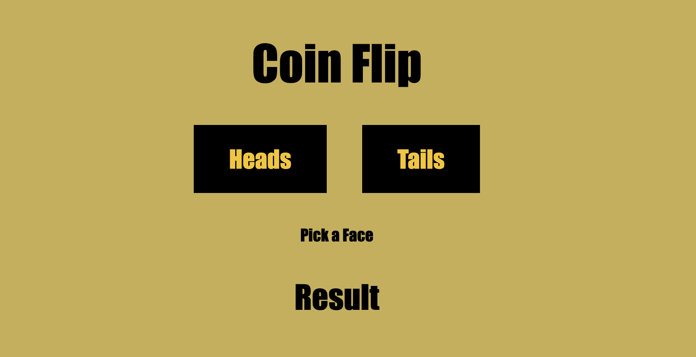

# 💸 Node Coin Flip Game

A **coin flip guessing game** built with Node.js. Pick heads or tails, flip the coin, and see if you guessed right! 🪙

## 📸 Project Preview 

<!-- Add your screenshot below -->


Users guess **heads or tails**, and the game randomly flips a coin to see if they were right.

## ✨ Features

- Guess heads or tails
- Randomly flip a coin
- Find out if your guess was right or wrong
- Dynamically display the result on the page
- Runs on a Node.js server
- Simple and user-friendly interface

## 🛠️ Built With

- HTML
- CSS
- JavaScript
- Node.js
- `http` module
- `fs` module

## 🎯 Project Goal

The goal of this project was to build a web application using Node's built-in `http` and `fs` modules.

The `http` module creates the server, and the `fs` module reads the HTML file so it can be sent to the browser. The game logic is written in vanilla ES6 JavaScript.

## 💡 What I Learned

This project helped me understand how a basic Node.js server works and how it sends files to the browser.

I also gained more experience working with:

- Creating a server with the `http` module
- Reading files with the `fs` module
- Handling requests and responses
- Randomization with `Math.random()`
- Event listeners
- DOM manipulation
- Conditional logic
- ES6 JavaScript

One of the biggest takeaways was seeing how a **Node server and front-end JavaScript work together** to create an interactive game.

## 🚀 Running the Project

To run this project locally:

1. Clone the repository:

```bash
git clone https://github.com/smayanja3/node-coin-flip.git
```

2. Navigate into the project folder.

3. Start the server:

```bash
node server.js
```

4. Open the local address shown in your terminal in your browser.

5. Make your guess and flip the coin! 🪙

---

Thanks for checking out my project! 💸✨